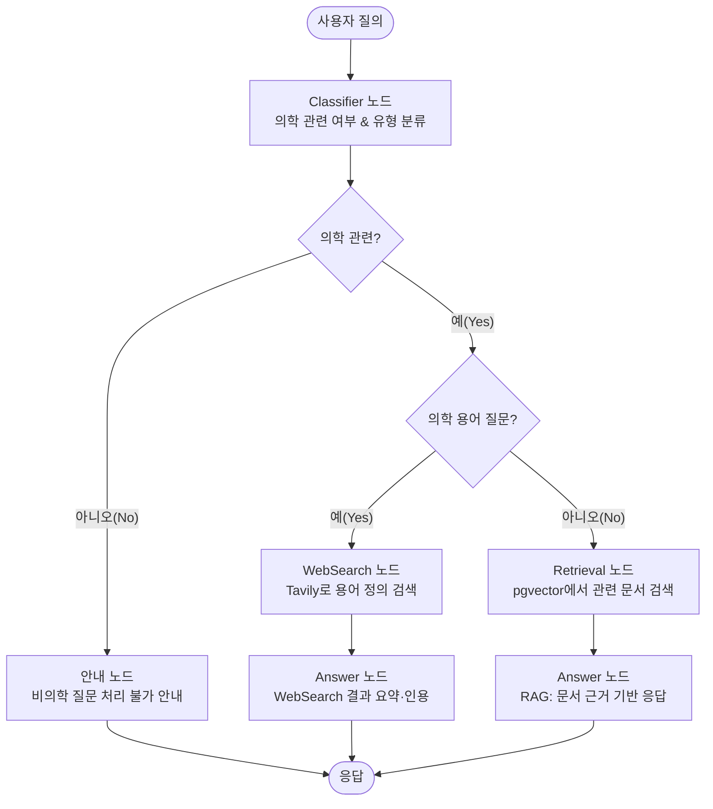
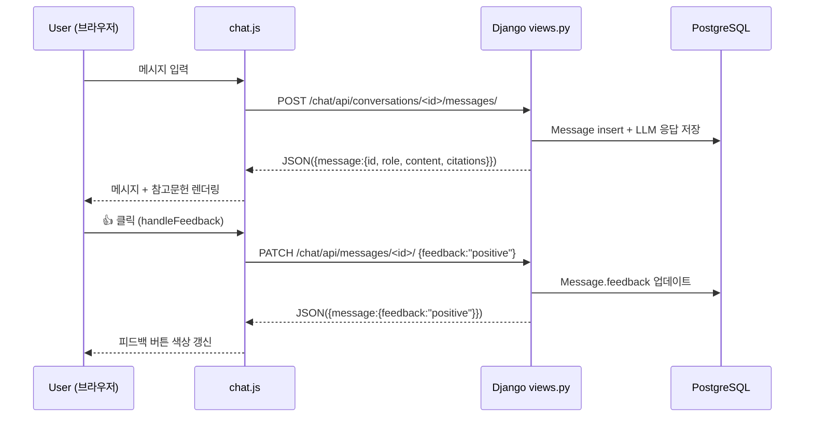

# SKN18-4th-4team


---

## Python
- version : 3.12.x

## 폴더 구조

- 역할 그룹 : django_app / graph / rag

```text
SKN18-4th-4Team/
├─ requirements.txt                         # 의존성 통합
├─ README.md                                # PT
├─ README_exec.md                           # 실행 관련
├─ .env.example
├─ Makefile
│
├─ scripts/
│  ├─ init_db.sql                           # CREATE EXTENSION vector; 테이블/인덱스 초기 스키마
│  ├─ seed_docs.py                          # (선택) 샘플 문서/청크/임베딩 시드
│  └─ embed_reindex.py                      # (선택) 임베딩 재생성/인덱스 리빌드 배치
│
├─ infra/
│  ├─ docker-compose.yml                    # postgres(pgvector)+django 컨테이너 오케스트레이션
│  ├─ nginx.conf                            # (선택) 운영 배포용 리버스 프록시
│  └─ docker/
│     ├─ django_app.Dockerfile              # Django 컨테이너 이미지
│     └─ postgres.Dockerfile                # (선택) 커스텀 pgvector 이미지
│
├─ django_app/                              # Django 웹앱(화면+API)
│  ├─ manage.py
│  ├─ core/
│  │  ├─ settings/
│  │  │  ├─ base.py                         # 공통 설정: INSTALLED_APPS/DB/STATIC/TEMPLATES/로그 등
│  │  │  ├─ dev.py                          # 개발용 오버라이드
│  │  │  └─ prod.py                         # 운영용 오버라이드
│  │  ├─ env.py                             # django-environ 로더(.env)
│  │  └─ logging.py                         # 로깅 포맷/핸들러/레벨
│  ├─ urls.py                               # 전역 URL include(accounts/docs/qa/adminui)
│  ├─ asgi.py
│  ├─ wsgi.py
│  ├─ templates/
│  │  ├─ base.html                          # Bootstrap 공통 레이아웃
│  │  └─ _partials/                         # 공통 조각(네비/알림 등)
│  │     ├─ _navbar.html
│  │     └─ _alerts.html
│  ├─ static/                               # 전역 정적(css/js/img)
│  │  ├─ css/
│  │  ├─ js/
│  │  └─ img/
│  ├─ accounts/                             # 로그인/권한/프로필
│  │  ├─ models.py
│  │  ├─ views.py
│  │  ├─ forms.py                           # (선택) 폼 기반 로그인/프로필 수정
│  │  ├─ urls.py
│  │  └─ templates/accounts/login.html
│  ├─ docs/                                 # 문서 목록/상세(업로드 미사용 → 화면만)
│  │  ├─ models.py                          # Doc/Chunk 메타(권한/소스 구분)
│  │  ├─ views.py
│  │  ├─ urls.py
│  │  └─ templates/docs/{list,detail}.html
│  ├─ qa/                                   # 검색/QA 화면 + JSON API
│  │  ├─ views.py                           # /search 템플릿, /api/qa 핸들러
│  │  ├─ serializers.py                     # API 응답 스키마(검증/직렬화)
│  │  ├─ urls.py
│  │  └─ templates/qa/{search,history}.html
│  ├─ adminui/                              # 운영/모니터링(인덱스/로그/비용)
│  │  ├─ views.py
│  │  ├─ urls.py
│  │  └─ templates/adminui/status.html
│  └─ adapters/                             # 외부 레이어 연동(의존성 역전 지점)
│     ├─ graph_runner.py                    # LangGraph compile/app 실행 래퍼
│     └─ rag_repo.py                        # rag.services 호출(검색/임베딩) thin wrapper
│
├─ graph/                                   # LangGraph 파이프라인(비즈니스 절차서)
│  ├─ state.py                              # State 타입/리듀서(메시지 누적 등)
│  ├─ nodes/
│  │  ├─ router.py                          
│  │  └─ ...
│  ├─ llm_client.py                         # LLM 클라이언트(공통 인터페이스 적용)
│  ├─ memory/
│  │  └─ checkpointer_pg.py                 # (선택) 세션/대화 기록 저장(Postgres/Redis)
│  ├─ compile.py                            # graph.compile() 정의(엔트리 포인트)
│  └─ data/                                 # (선택) 그래프 실행 로그/샘플 state
│
└─ rag/                                     # RAG + pgvector + ETL(데이터/검색 계층)
   ├─ schema/
   │  └─ init_db.sql                        # CREATE EXTENSION vector; doc/chunk/embedding 테이블, 인덱스
   ├─ queries/
   │  ├─ search.sql                         # Top-K 벡터 검색(SQL; access_scope 필터 포함)
   │  ├─ maintenance.sql                    # 인덱스/통계 유지관리
   │  └─ stats.sql                          # 검색 성능/품질 진단
   ├─ services/
   │  ├─ embedder.py                        # e5-small 등 임베딩 공용 래퍼(질문/패시지)
   │  └─ retriever.py                       # 질문 임베딩→pgvector Top-K→ChunkDict 리스트 반환
   ├─ etl/                                  # (업로드 미사용이지만 ETL 파이프는 유지)
   │  ├─ extract/                           # [E]: 원천 데이터 수집(크롤/기등록 데이터 로드)
   │  │  └─ ...                             # 미사용 시 비워두기
   │  ├─ transform/                         # [T]: 파싱/클리닝/청킹
   │  │  ├─ parser_pdf.py                   # PDF→text
   │  │  ├─ parser_html.py                  # HTML→text
   │  │  ├─ cleaner.py                      # 노이즈 제거/정규화
   │  │  └─ chunker.py                      # 문단/슬라이딩 윈도우 청킹
   │  ├─ embed/                             # 임베딩 생성(패시지용)
   │  │  ├─ model_e5.py                     # multilingual-e5-small 호출 래퍼
   │  │  └─ embed_runner.py                 # 청크 임베딩 배치 실행
   │  └─ load/                              # [L]: DB 적재/인덱싱
   │     ├─ db_writer.py                    # doc/chunk/embedding insert/upsert
   │     └─ index_builder.py                # ivfflat 튜닝(lists/probes)
   ├─ data/                                 # 원문/청크/임베딩 파일(csv/jsonl 등)
   └─ assets/                               # (선택) ERD/ETL 흐름도/운영 문서 이미지
```


- 역할 분담 폴더 수정 금지
  - 역할 분담 폴더 내 하위 폴더 변경/수정 가능
- **django_app/**
  - 백오피스 : adminui, docs
- **scripts/**
  - 루트 실행 스크립트, 전체 파이프라인을 조합하고 실행, 
  - 즉, ETL 모듈을 불러와서 실제로 실행시키는 역할만 담당
  - seed_docs.py : 샘플 문서와 청크 데이터를 DB에 ‘최초로’ 넣는 스크립트
  - embed_reindex.py : 벡터 임베딩 생성 및 인덱스 재구축
  
| 파일 경로                    | 목적                                 | 실행 시점                                        | 특징                                           |
| ------------------------ | ---------------------------------- | -------------------------------------------- | -------------------------------------------- |
| `scripts/init_db.sql`    | **DB 전체 초기화용 (infra/compose와 함께)** | `docker-compose up` 할 때 자동 실행                | DB 확장(`CREATE EXTENSION vector`) + 공용 스키마 세팅 |
| `rag/schema/init_db.sql` | **RAG용 스키마 정의 (문서/청크/임베딩 관련)**     | 수동 실행(`psql -f` or `scripts/seed_docs.py` 전) | `docs`, `chunks`, `embeddings` 등 도메인 스키마 중심  |


- **rag/**
  - index_builder.py
    - pgvector 인덱스를 “어떻게 쪼개서, 얼마나 빠르게 검색할지”를 결정하고, 이를 자동 튜닝하는 스크립트
    - LLM이 질문할 때 → retriever가 벡터 검색을 하기 전 → “어떤 방식으로 벡터를 인덱싱해둘지”를 설정해주는 역할
    - ivfflat 인덱스 : pgvector는 일반 B-tree 대신 “IVFFLAT(Indexed Vector Flat)” 구조를 사용
    - IVFFLAT은 단순히 인덱스를 만드는 게 아니라, K-means clustering으로 벡터 공간을 “lists” 개수만큼 쪼갠다.


---

# LangGraph

- 내/외부 의사 결정



---

# RAG


---


# Web



