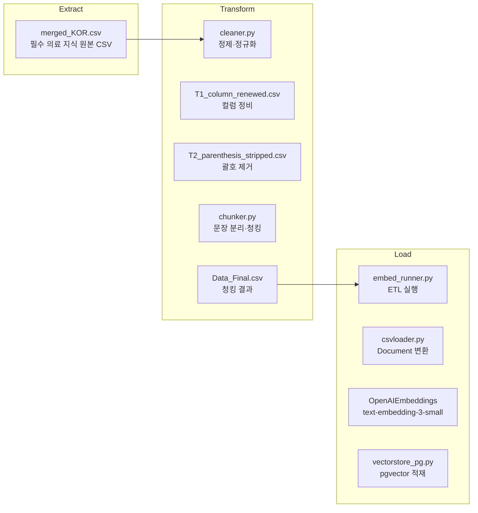
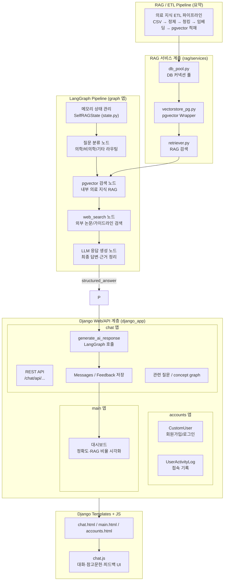

# SKN18-4th-Team

## [팀]

| 이름    | 역할   | 세부 역할 |   
|:------: |:-----: |:-------------------: |  
| 정동석  | 팀장   | RAG, LangGraph  |   
| 최준호  | 팀원   | 데이터 전처리 |   
| 이상효  | 팀원   | 데이터 전처리, RAG, Memory |   
| 안시현  | 팀원   | LangGraph |    
| 정인하  | 팀원   | LangGraph, Memory |   
| 황혜진  | 팀원   | WEB | 

## [주제]

### **🧬 MedAI Research**
> 의료 연구 AI 어시스턴트  
> LLM을 연동한 내·외부 문서 기반 질의응답 웹페이지

### 📌 서비스 개요
MedAI Research는 의료 연구·임상 진료·학술 활동에서 반복되는 **논문 검색·가이드라인 확인·임상 지침 비교**에 드는 시간을 줄이기 위해 설계된 **AI 기반 Evidence Assistant** 입니다.  
 의학 지식은 오류가 허용되지 않기 때문에, 단순 요약이나 일반적인 생성형 답변이 아닌  
 **“근거 기반(Evidence-Based)”**, **“출처가 명확한”**, **“재현 가능한”** 답변을 제공하는 것이 핵심입니다.

### **✔ 핵심 목표**
* **최신 논문·가이드라인 기반**의 신뢰 가능한 답변 제공  
* 반복적이고 시간이 많이 드는 문헌 검색·근거 비교 프로세스를 자동화  
* 의료 연구자·의사·대학원생들이 **임상적 판단 근거**를 빠르게 확보할 수 있도록 지원  
* RAG + LangGraph 기반으로 **추론 품질, 신뢰성, 근거 재현성**을 확보  
* 필수 의료 지식 **1.5만 Q&A + 전문 의료 문서 + 교과서** 기반 지식 그래프 활용

### 🎯 타겟 사용자
* 의료 연구자(Researcher)  
* 임상의(Physician)  
* 의과대학 대학원생(Medical Grad Student)  
* 임상시험 코디네이터(Clinical Trial Coordinator)

### 🎯 타겟 요구사항
* 최신 가이드라인·논문 근거를 빠르게 확인하고, 진료 의사결정을 위한 **정확한 근거 중심 답변**을 필요로 함.
* 논문 구조 요약, 연구방법 해석, 발표 준비를 위한 **체계적·단계별 요약 기능**과 후속 질문 생성이 필요함.
* Eligibility 조건, ECOG/lab cutoff 등 기준 정보를 **정확하게 정규화·추출**해주는 기능을 요구함.
* 특정 biomarker/outcome 기준으로 **연관 연구 탐색**, 근거 스니펫 추출, 비교 가능한 정리 기능이 필요함.

## [프로젝트 구조]

```text  
SKN18-4th-4team/  
├─ infra/                     # 로컬/배포 인프라 구성  
│  ├─ docker-compose.yml      # Postgres+pgvector+Django 컨테이너 오케스트레이션  
│  └─ nginx.conf              # 배포용 리버스 프록시 설정  
├─ scripts/                   # 데이터베이스/임베딩 파이프라인을 돌리는 독립 스크립트 모음  
│  ├─ init_db.sql             # pgvector 확장 및 기본 스키마 생성  
│  └─ init_models.sql/.py     # RAG 모델 구조 초기화/등록  
├─ django_app/                # Django 기반 웹/백오피스/챗봇 API  
│  ├─ manage.py               # Django 관리자 CLI 엔트리  
│  ├─ config/                 # settings/env 로더/urls/wsgi/asgi 등 전역 설정  
│  ├─ accounts/               # 인증·권한·프로필 관련 앱  
│  ├─ chat/                   # 챗봇 도메인의 모델, 서비스, API, LLM 연동  
│  ├─ main/                   # 랜딩 및 일반 페이지 뷰  
│  ├─ templates/              # SSR 템플릿(base, partials, 앱별 화면)  
│  ├─ static/                 # 원본 정적 리소스(css/js/img)  
│  └─ uploads/                # 사용자 업로드 파일(예: 프로필 이미지)  
├─ graph/                     # LangGraph 기반 LLM 워크플로 정의  
│  ├─ compile.py              # 그래프 빌드 엔트리포인트  
│  ├─ state.py                # 공유 state 스키마 및 업데이트 로직  
│  ├─ llm_client.py           # LLM 추상화/호출 래퍼  
│  ├─ nodes/                  # classifier/retrieval/answer/web-search 등 개별 노드  
│  ├─ memory/                 # 체크포인터·대화 기록 영속화  
│  └─ data/                   # 그래프 실행 예시/샘플 상태  
├─ rag/                       # RAG 데이터 계층 + ETL 파이프라인  
│  ├─ schema/                 # 문서/청크/임베딩 스키마 SQL  
│  ├─ queries/                # 검색·유지보수·통계 SQL 및 chat_memory.sqlite3  
│  ├─ services/               # embedder/retriever/vectorstore/DB 풀 모듈  
│  ├─ etl/                    # extract/transform/embed/load 단계 스크립트  
│  │  ├─ extract/             # 원천 데이터 적재 템플릿  
│  │  ├─ transform/           # 파싱·클리닝·청킹 도구  
│  │  ├─ embed/               # 임베딩 생성 러너  
│  │  └─ load/                # DB 적재 및 인덱스 빌더  
│  └─ data/                   # 문서/청크/임베딩 샘플 데이터  
└─ graph/ask.py               # LangGraph와 Django 중간 호출 유틸  
```

## [도구/기술]

#### **Environment**    
    
    
    
  

#### **Development**    
    
    
  

#### **Database / Infrastructure**    
    
    
  

#### **Communication**    


## [요구사항]

**1️⃣ 데이터 수집 및 전처리 모듈**
- 의학 문헌(가이드라인, 논문, 교과서, 동의서 등)을 안정적으로 수집하고, RAG에 활용할 수 있는 정제된 텍스트 데이터로 변환한다.

**2️⃣ 질의 응답 플로우 설계 및 구축 (LangGraph 기반 오케스트레이션)**
- 의료 질문이 들어왔을 때, 일관된 흐름으로 처리되도록 LangGraph 기반 워크플로우를 설계한다.
- LangGraph는 다음 노드들을 그래프 형태로 연결하여,  질문 1건당 하나의 “추론 파이프라인”으로 실행되도록 구성.
- 메모리 → 질문 분류 → 용어 판별 → 검색/웹서치 → 검증 → 답변 생성 → 메모리 기록 → 답변 출력

**3️⃣ RAG ETL 파이프라인 (pgvector 기반)**
- 내외부 의료 문서를 RAG용 벡터 인덱스로 변환하는 ETL 파이프라인 구축

**4️⃣ 웹 UI & 시각화 (Django SSR + JS)**
- 연구자/의사가 실제로 사용할 수 있는 웹 인터페이스를 제공하고,  AI 대화·근거·통계를 한 화면에서 확인할 수 있게 한다.**

**5️⃣ 관측·품질·로그 (Observability & Quality Tracking)**
- 서비스 운영 중 무슨 질문에 어떤 답이 나갔고, 근거와 품질이 어땠는지 추적 가능하게 만든다.**

## [수집 데이터]
- AI-Hub 필수 의료 지식 : https://www.aihub.or.kr/aihubdata/data/view.do?&aihubDataSe=data&dataSetSn=71875

## [화면 구성]

- **도구** : Figma, HTML, CSS, Javascript


# [설계]

1. ## ETL



2. ## **시스템 구성 및 흐름도**



## [구현]

### 1. RAG
 - **목적**: 데이터 전처리~ 임베딩(ETL) 모듈화 및 진행 후 유저의 질문의 유사도가 높은 청킹데이터 추출  
 - **결과**: ETL 파이프라인 구축, 유사도 테스트를 통한 질문과 관련성 높은 청킹 추출  
 
#### ETL  
1) Cleaning:
 - Column 재정의
   - c_id, source_spec, creation_year 문헌 레퍼런스 형식으로 재조합  
   - ex) guide_kr_2023_1182_1  
   - content 유지  
   - 그 외 나머지 Column Drop
 - 숫자 + 온점(.) 클리닝
   - 데이터 상에서 항목은 필요없음 → Drop
 - 인용구 Drop
   - 번역 / 인용 구분 후 인용구만 Drop
 - 큰따옴표 클리닝
   - Content 내에 있는 큰따옴표 클리닝
 - c_id 컬럼 내 연도가 2023.0 처럼 소수점이 있는 부분 소수점 Drop (2023.0 → 2023)
 - ( 5%)와 같이 ( 뒤에 공백이 있는 부분 strip
2) Chunking:
 - 문장단위 Chunking
   - . ! ? 로 끊기는 부분을 문장으로 인식, 3개의 갯수를 카운트하고 2문장 단위로 Chunking
3) Embeding:  
 - OPENAI Model: text-embedding-3-small  
 - batch_size = 100  
 - 동기로 실행  
 - Dimension_size=1536  
 - 소요시간: 약 30분

### pgvector  
1) Data  
 - 원본 문서 수: 9686개  
 - pgvector 데이터 수: 116420개  
2) Column  
 - id: Auto_Increament  
 - content: raw data  
 - embedding: Embedding Data  
 - metadata: c_id (Reference)

### retriver  
 1) Classify node에서 query embedding 진행  
 2) Similarity: 코사인 유사도 검색  
 3) TOP_K: 5개  
 4) 참조문헌: Metadata 사용 (단, 중복제외)

### evaluation  
 1) 질문과 코사인 유사도로 뽑힌 Chunk들의 관련성을 평가  
 2) 0~1점 사이로 점수를 LLM이 자체적으로 평가  
 3) 각 청크의 점수가 0.3점 이하면 Drop  
 4) chunk가 1개 이상 뽑히면 → Generate_Answer  
 5) chunk가 1개도 안뽑히면(0개) → rewrite_query 


## 2. LangGraph
- **역할** : **전체 AI 파이프라인을 오케스트레이션(orchestration)** 하는 핵심 엔진 (운영, 실험, 안전, 재시도 등)
- **목적**:  
  `langgraph` 워크플로우로 의료 특화 Self-RAG 파이프라인을 구성해 질문 유형에 따라 사용자 정보·비의학·의학 질문을 자동 라우팅하고, 용어 질문은 WebSearch, 일반 의학 질문은 RAG 검색으로 보내도록 설계
- **워크플로우 :** 메모리 → 질문 분류 → 용어 판별 → 검색/웹서치 → 검증 → 답변 → 메모리 기록  
- **노드 별 기능**  
  - **memory_read** : sqlLightDB에 저장된 기존 대화내역 전달(user_info는 5개, medical은 1개)  
  - **classifier** : 사용자의 질문을 medical, user_info, none_medical로 분류  
  - **medical_check** : vectorDB / Websearch 대상(의학 용어)인지 판별  
  - **retriver** : vectorDB에서 유사도 검색을 통해 유사도 높은 청크 5개 추출  
    **evaluate_chunk** : 추출된 5개의 청크가 원본질문과 연관성이 있는지 llm이 판단하여 점수 부여.  
  		       재작성 후 추출된 모든 청크가 질문과 관련이 없는 경우  최종 메세지와 함께 END  
    **rewrite_query** : evaluate_chunk에서 낮은 점수가 나오면 llm이 질문을 재작성하여 retriver로 전달(최대 1번)  
  - **WebSearch** : Tavily를 사용해 의학 용어 정의 검색  
  - **Generate_answer** : 답변 형식 고정, llm 판단 점수출력, 출처 추출  
  - **memory_write** : 질문과 Generate_answer에서 생성된 답변 원본과 summary, 채팅창 아이디(conversation_id)를 sqlLightDB에 저장  
    
  [ LangGraph 흐름도]  
    
    
    
  더 자세한 구현 사항은 issue를 참고해 주세요  
  ([https://github.com/SKNETWORKS-FAMILY-AICAMP/SKN18-4th-4team/issues/47](https://github.com/SKNETWORKS-FAMILY-AICAMP/SKN18-4th-4team/issues/47))


### 3. WEB

- **목적** : AI 기반 연구지원 플랫폼의 웹 인터페이스를 구현하여, 사용자 인증·대화 이력 관리·데이터 시각화 등을 통합적으로 제공한다.  
- **도구** : Django Framework (SSR 기반 MVT 구조)  
  - Django의 MVT(Model–View–Template) 패턴을 사용  
  - 서버에서 HTML을 렌더링하는 **SSR(Server-Side Rendering)** 방식으로 화면을 제공  
- **핵심 기능**:  
  - 인증 / 가입  
    - django.contrib.auth + Form 기반 로그인/회원가입 (SignupForm, UserCreationForm)  
    - 비밀번호 찾기 : SMTP 이메일 전송  
    - 프로필: 이미지 파일 업로드  
    - 사용자 활동 로그: Middleware로 URL/메서드/User-Agent/IP 저장  
    - 페이지 접근 제한은 `@login_required` 데코레이터로 처리 (Middleware 대체)  
  - AI 대화 기능  
    - Conversation 모델 기반 대화 관리  
    - Message 모델로 사용자/AI 메시지 저장  
    - LangGraph/LLM 연동 (AI 응답 + 참고문헌)  
    - 피드백 관리(👍/👎, 사유 코드 저장)  
    - AI 보조 도구: **Concept Graph**(Mermaid 다이어그램) 생성, **연관 질문 생성**  
  - 대시보드  
    - 대화량·사용자 수·정확도·참고문헌 비율 등 실시간 **메트릭 집계**  
- **주요 모델** :   
  - **CustomUser** : 사용자 이름과 이메일을 기반으로 로그인하는 **커스텀 사용자 모델**  
  - **UserActivityLog** : 사용자가 접근한 **URL, HTTP 메서드, User-Agent, IP** 등을 기록하는  
  - 간단한 **활동 감사 로그(audit log)** 모델 (보안 점검 및 사용 패턴 분석)  
  - **ChatConversation** : 한 사용자의 **개별 대화 세션**을 나타내는 모델  
  - **Message**: 대화 안의 **개별 메시지**를 저장합니다. 역할, 본문, 참고문헌,  
    응답 품질, concept graph 정보, 사용자 피드백 등 관리  
  - **MessageFeedback** : 특정 메시지에 대해 사용자가 남긴 **피드백과 사유**를 저장합니다. (예: 사실 오류, 참고문헌 오류 등)  
- **주요 API**   
  - **Accounts**:   
    - **GET/POST · `/accounts/login/`**  
      - 커스텀 로그인 화면을 보여주고, 로그인 요청을 처리  
    - **GET · `/accounts/logout/`**  
      - 로그아웃 후 로그인 페이지로 이동  
    - **GET/POST · `/accounts/register/`**  
      - 이름·이메일 기반 회원가입을 처리하고 약관 동의 여부를 저장  
    - **POST · `/accounts/profile-image/`**  
      - 프로필 이미지를 업로드. 인증 여부와 파일 크기를 체크한 뒤 저장된 이미지 경로 반환  
  - **Chat**  
  - **GET/POST · `/chat/api/conversations/`**  
* GET: 사용자의 전체 대화 목록 조회  
* POST: 새 대화 생성  
  - **GET/DELETE · `/chat/api/conversations/<id>/`**  
    - 특정 대화를 조회하거나 삭제(soft delete, archive)  
  - **POST · `/chat/api/conversations/<id>/messages/`**  
    - 사용자 메시지를 저장한 뒤, LangGraph/LLM을 호출하여 AI 답변과 참고문헌(citations)을 함께 반환  
  - **PATCH · `/chat/api/messages/<id>/`**  
    -  특정 메시지에 대해 **긍정/부정 평가와 사유**를 저장하거나 삭제  
  - **POST · `/chat/api/messages/<id>/concept-graph/`**  
    -  AI 응답 내용을 기반으로 **Mermaid 다이어그램 코드**를 생성하고 캐시  
  - **POST · `/chat/api/messages/<id>/related-questions/`**  
    -  AI 응답을 분석하여 **연관 후속 질문 3개**를 생성  
- **향후 개선 방향**:  
  - 사용자별 피드백 통계  
  - 피드백 기반 AI 메모리 개선  
  - 모델별 응답 비교 기능  
  - 관리자 페이지 강화

## [평가]

유사도 점수


llm 평가

  


