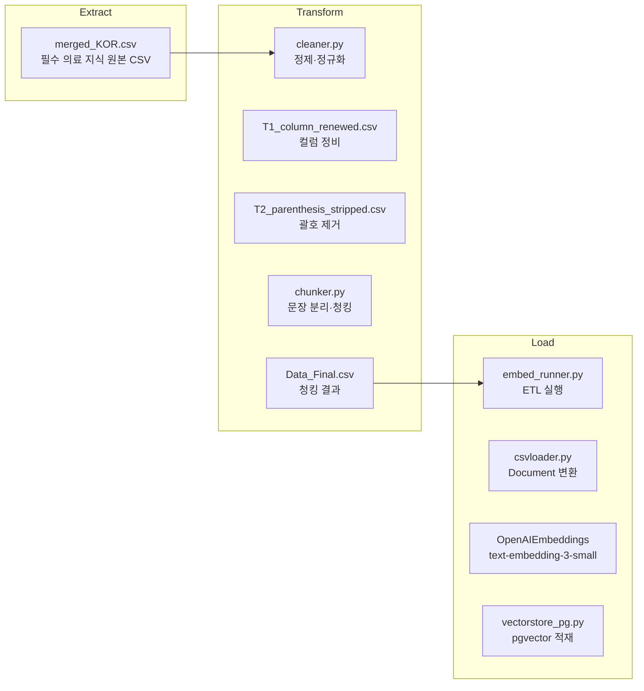
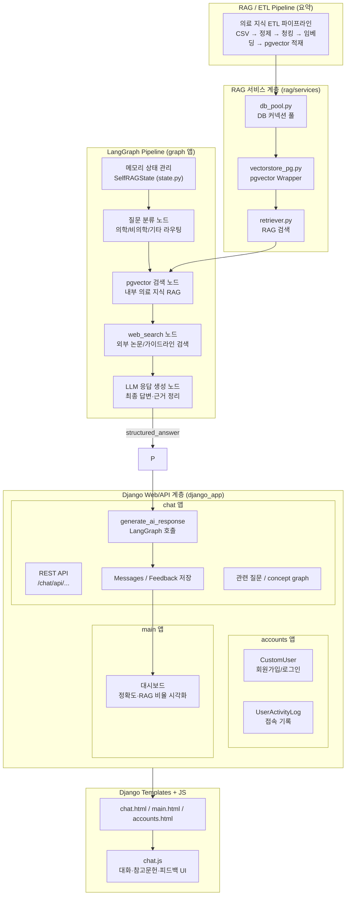
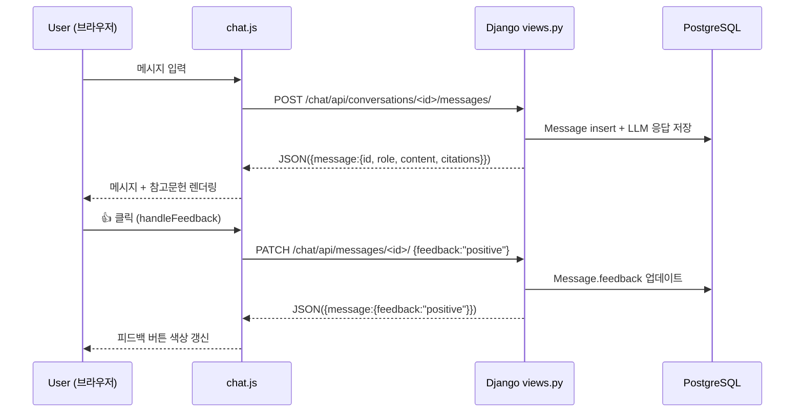

# SKN18-4th-Team

## [팀]

| 이름    | 역할   | 세부 역할 |   
|:------: |:-----: |:-------------------: |  
| 정동석  | 팀장   | RAG, LangGraph  |   
| 최준호  | 팀원   | 데이터 전처리 |   
| 이상효  | 팀원   | 데이터 전처리, RAG, Memory |   
| 안시현  | 팀원   | LangGraph |    
| 정인하  | 팀원   | LangGraph, Memory |   
| 황혜진  | 팀원   | WEB | 

## [주제]

### **🧬 MedAI Research**
> 의료 연구 AI 어시스턴트  
> LLM을 연동한 내·외부 문서 기반 질의응답 웹페이지

### 📌 서비스 개요
MedAI Research는 의료 연구·임상 진료·학술 활동에서 반복되는 **논문 검색·가이드라인 확인·임상 지침 비교**에 드는 시간을 줄이기 위해 설계된 **AI 기반 Evidence Assistant** 입니다.  
 의학 지식은 오류가 허용되지 않기 때문에, 단순 요약이나 일반적인 생성형 답변이 아닌  
 **“근거 기반(Evidence-Based)”**, **“출처가 명확한”**, **“재현 가능한”** 답변을 제공하는 것이 핵심입니다.

### **✔ 핵심 목표**
* **최신 논문·가이드라인 기반**의 신뢰 가능한 답변 제공  
* 반복적이고 시간이 많이 드는 문헌 검색·근거 비교 프로세스를 자동화  
* 의료 연구자·의사·대학원생들이 **임상적 판단 근거**를 빠르게 확보할 수 있도록 지원  
* RAG + LangGraph 기반으로 **추론 품질, 신뢰성, 근거 재현성**을 확보  
* 필수 의료 지식 **1.5만 Q&A + 전문 의료 문서 + 교과서** 기반 지식 그래프 활용

### 🎯 타겟 사용자
* 의료 연구자(Researcher)  
* 임상의(Physician)  
* 의과대학 대학원생(Medical Grad Student)  
* 임상시험 코디네이터(Clinical Trial Coordinator)

### 🎯 타겟 요구사항
* 최신 가이드라인·논문 근거를 빠르게 확인하고, 진료 의사결정을 위한 **정확한 근거 중심 답변**을 필요로 함.
* 논문 구조 요약, 연구방법 해석, 발표 준비를 위한 **체계적·단계별 요약 기능**과 후속 질문 생성이 필요함.
* Eligibility 조건, ECOG/lab cutoff 등 기준 정보를 **정확하게 정규화·추출**해주는 기능을 요구함.
* 특정 biomarker/outcome 기준으로 **연관 연구 탐색**, 근거 스니펫 추출, 비교 가능한 정리 기능이 필요함.

## [프로젝트 구조]

```text  
SKN18-4th-4team/  
├─ infra/                     # 로컬/배포 인프라 구성  
│  ├─ docker-compose.yml      # Postgres+pgvector+Django 컨테이너 오케스트레이션  
│  └─ nginx.conf              # 배포용 리버스 프록시 설정  
├─ scripts/                   # 데이터베이스/임베딩 파이프라인을 돌리는 독립 스크립트 모음  
│  ├─ init_db.sql             # pgvector 확장 및 기본 스키마 생성  
│  └─ init_models.sql/.py     # RAG 모델 구조 초기화/등록  
├─ django_app/                # Django 기반 웹/백오피스/챗봇 API  
│  ├─ manage.py               # Django 관리자 CLI 엔트리  
│  ├─ config/                 # settings/env 로더/urls/wsgi/asgi 등 전역 설정  
│  ├─ accounts/               # 인증·권한·프로필 관련 앱  
│  ├─ chat/                   # 챗봇 도메인의 모델, 서비스, API, LLM 연동  
│  ├─ main/                   # 랜딩 및 일반 페이지 뷰  
│  ├─ templates/              # SSR 템플릿(base, partials, 앱별 화면)  
│  ├─ static/                 # 원본 정적 리소스(css/js/img)  
│  └─ uploads/                # 사용자 업로드 파일(예: 프로필 이미지)  
├─ graph/                     # LangGraph 기반 LLM 워크플로 정의  
│  ├─ compile.py              # 그래프 빌드 엔트리포인트  
│  ├─ state.py                # 공유 state 스키마 및 업데이트 로직  
│  ├─ llm_client.py           # LLM 추상화/호출 래퍼  
│  ├─ nodes/                  # classifier/retrieval/answer/web-search 등 개별 노드  
│  ├─ memory/                 # 체크포인터·대화 기록 영속화  
│  └─ data/                   # 그래프 실행 예시/샘플 상태  
├─ rag/                       # RAG 데이터 계층 + ETL 파이프라인  
│  ├─ schema/                 # 문서/청크/임베딩 스키마 SQL  
│  ├─ queries/                # 검색·유지보수·통계 SQL 및 chat_memory.sqlite3  
│  ├─ services/               # embedder/retriever/vectorstore/DB 풀 모듈  
│  ├─ etl/                    # extract/transform/embed/load 단계 스크립트  
│  │  ├─ extract/             # 원천 데이터 적재 템플릿  
│  │  ├─ transform/           # 파싱·클리닝·청킹 도구  
│  │  ├─ embed/               # 임베딩 생성 러너  
│  │  └─ load/                # DB 적재 및 인덱스 빌더  
│  └─ data/                   # 문서/청크/임베딩 샘플 데이터  
└─ graph/ask.py               # LangGraph와 Django 중간 호출 유틸  
```

## [도구/기술]

#### **Environment**    
    
    
    
  

#### **Development**    
    
    
  

#### **Database / Infrastructure**    
    
    
  

#### **Communication**    


## [요구사항]

**1️⃣ 데이터 수집 및 전처리 모듈**
- 의학 문헌(가이드라인, 논문, 교과서, 동의서 등)을 안정적으로 수집하고, RAG에 활용할 수 있는 정제된 텍스트 데이터로 변환한다.

**2️⃣ 질의 응답 플로우 설계 및 구축 (LangGraph 기반 오케스트레이션)**
- 의료 질문이 들어왔을 때, 일관된 흐름으로 처리되도록 LangGraph 기반 워크플로우를 설계한다.
- LangGraph는 다음 노드들을 그래프 형태로 연결하여,  질문 1건당 하나의 “추론 파이프라인”으로 실행되도록 구성.
- 메모리 → 질문 분류 → 용어 판별 → 검색/웹서치 → 검증 → 답변 생성 → 메모리 기록 → 답변 출력

**3️⃣ RAG ETL 파이프라인 (pgvector 기반)**
- 내외부 의료 문서를 RAG용 벡터 인덱스로 변환하는 ETL 파이프라인 구축

**4️⃣ 웹 UI & 시각화 (Django SSR + JS)**
- 연구자/의사가 실제로 사용할 수 있는 웹 인터페이스를 제공하고,  AI 대화·근거·통계를 한 화면에서 확인할 수 있게 한다.

**5️⃣ 관측·품질·로그 (Observability & Quality Tracking)**
- 서비스 운영 중 무슨 질문에 어떤 답이 나갔고, 근거와 품질이 어땠는지 추적 가능하게 만든다.

## [수집 데이터]
- **AI-Hub 필수 의료 지식**
  - https://www.aihub.or.kr/aihubdata/data/view.do?&aihubDataSe=data&dataSetSn=71875
  - 학술 논문 및 저널, 온라인 의료 정보 제공 사이트, 정부기관 가이드라인, 학회 가이드라인, 국제기관 가이드라인, 의학 교과서, 기타 (수술/검사/기타 동의서)

## [화면 구성]

- **도구** : Figma, HTML, CSS, Javascript


# [설계]

## 1. ETL



## 2. **시스템 구성 및 흐름도**



- 시퀀스 다이어그램(Sequence Diagram)


## [구현]

### 1. RAG
 - **목적**: 데이터 전처리~ 임베딩(ETL) 모듈화 및 진행 후 유저의 질문의 유사도가 높은 청킹데이터 추출  
 - **결과**: ETL 파이프라인 구축, 유사도 테스트를 통한 질문과 관련성 높은 청킹 추출  
 
#### 1) ETL  

- **Cleaning:** Column 재정의, 숫자/온점/따옴표 클리닝, 인용구 Drop, c_id 컬럼 소수점 Drop ,공백 strip
- **Chunking:** 문장 단위 Chunking
- **Embeding:**
  - OPENAI Model: **text-embedding-3-small**
  - batch_size = 100 / Dimension_size=1536 / 소요시간: 약 30분

#### 2) pgvector  
- **Data**
  - 원본 문서 수: 9686개  
  - pgvector 데이터 수: 116420개  
- **Column**
  - id: Auto_Increament  
  - content: raw data  
  - embedding: Embedding Data  
  - metadata: c_id (Reference)

#### 3) retriver  
 - Classify node에서 query embedding 진행  
 - Similarity: 코사인 유사도 검색  
 - TOP_K: 5개  
 - 참조문헌: Metadata 사용 (단, 중복제외)

#### 4) evaluation  
 - 질문과 코사인 유사도로 뽑힌 Chunk들의 관련성을 평가  
 - 0~1점 사이로 점수를 LLM이 자체적으로 평가  
 - 각 청크의 점수가 0.3점 이하면 Drop  
 - chunk가 1개 이상 뽑히면 → Generate_Answer  
 - chunk가 1개도 안뽑히면(0개) → rewrite_query 


## 2. LangGraph
- **역할** : **전체 AI 파이프라인을 오케스트레이션(orchestration)** 하는 핵심 엔진 (운영, 실험, 안전, 재시도 등)
- **목적**:  
  `langgraph` 워크플로우로 의료 특화 Self-RAG 파이프라인을 구성해 질문 유형에 따라 사용자 정보·비의학·의학 질문을 자동 라우팅하고, 용어 질문은 WebSearch, 일반 의학 질문은 RAG 검색으로 보내도록 설계
- **워크플로우 :** 메모리 → 질문 분류 → 용어 판별 → 검색/웹서치 → 검증 → 답변 → 메모리 기록  
- **노드 별 기능**  
  - **memory_read** : sqlite3에 저장된 기존 대화내역 전달(user_info는 5개, medical은 1개)  
  - **classifier** : 사용자의 질문을 medical, user_info, none_medical로 분류  
  - **medical_check** : vectorDB / Websearch 대상(의학 용어)인지 판별  
  - **retriver** : vectorDB에서 유사도 검색을 통해 유사도 높은 청크 5개 추출  
    **evaluate_chunk** : 추출된 5개의 청크가 원본질문과 연관성이 있는지 llm이 판단하여 점수 부여.  
  		       재작성 후 추출된 모든 청크가 질문과 관련이 없는 경우  최종 메세지와 함께 END  
    **rewrite_query** : evaluate_chunk에서 낮은 점수가 나오면 llm이 질문을 재작성하여 retriver로 전달(최대 1번)  
  - **WebSearch** : Tavily를 사용해 의학 용어 정의 검색  
  - **Generate_answer** : 답변 형식 고정, llm 판단 점수출력, 출처 추출  
  - **memory_write** : 질문과 Generate_answer에서 생성된 답변 원본과 summary, 채팅창 아이디(conversation_id)를 sqlite3에 저장

- **메모리 시스템**
  - LLM 에이전트는 기본적으로 금붕어 뇌와 같아서, 그래프가 한 턴 실행될 때마다 바로 전 문장도 잊어버리는 특성
  - MemorySaver는 이 에이전트에게 블랙박스(기억 장치)를 달아주는 역할
  - 각 대화에서 중요한 순간만 캡처해 저장하고, 다음 턴에서 필요할 때만 적절히 불러와 사고 흐름에 삽입
  - **결론** : 에이전트는 이전 대화를 전부 기억하지 않아도 안정적인 추론 흐름을 유지 가능
    
  [ LangGraph 흐름도]  

  - **구상** 
  
    

  - **구현**
  
  
    
  더 자세한 구현 사항은 issue를 참고해 주세요  
  ([https://github.com/SKNETWORKS-FAMILY-AICAMP/SKN18-4th-4team/issues/47](https://github.com/SKNETWORKS-FAMILY-AICAMP/SKN18-4th-4team/issues/47))


### 3. WEB

- **목적** : AI 기반 연구지원 플랫폼의 웹 인터페이스를 구현하여, 사용자 인증·대화 이력 관리·데이터 시각화 등을 통합적으로 제공한다.  
- **도구** : Django Framework (SSR 기반 MVT 구조)  
  - Django의 MVT(Model–View–Template) 패턴을 사용  
  - 서버에서 HTML을 렌더링하는 **SSR(Server-Side Rendering)** 방식으로 화면을 제공  
- **핵심 기능**:  
  - 인증 / 가입  
    - django.contrib.auth + Form 기반 로그인/회원가입 (SignupForm, UserCreationForm)  
    - 비밀번호 찾기 : SMTP 이메일 전송  
    - 프로필: 이미지 파일 업로드  
    - 사용자 활동 로그: Middleware로 URL/메서드/User-Agent/IP 저장  
    - 페이지 접근 제한은 `@login_required` 데코레이터로 처리 (Middleware 대체)  
  - AI 대화 기능  
    - Conversation 모델 기반 대화 관리  
    - Message 모델로 사용자/AI 메시지 저장  
    - LangGraph/LLM 연동 (AI 응답 + 참고문헌)  
    - 피드백 관리(👍/👎, 사유 코드 저장)  
    - AI 보조 도구: **Concept Graph**(Mermaid 다이어그램) 생성, **연관 질문 생성**  
  - 대시보드  
    - 대화량·사용자 수·정확도·참고문헌 비율 등 실시간 **메트릭 집계**  
- **주요 모델** :   
  - **CustomUser** : 사용자 이름과 이메일을 기반으로 로그인하는 **커스텀 사용자 모델**  
  - **UserActivityLog** : 사용자가 접근한 **URL, HTTP 메서드, User-Agent, IP** 등을 기록하는  
  - 간단한 **활동 감사 로그(audit log)** 모델 (보안 점검 및 사용 패턴 분석)  
  - **ChatConversation** : 한 사용자의 **개별 대화 세션**을 나타내는 모델  
  - **Message**: 대화 안의 **개별 메시지**를 저장합니다. 역할, 본문, 참고문헌,  
    응답 품질, concept graph 정보, 사용자 피드백 등 관리  
  - **MessageFeedback** : 특정 메시지에 대해 사용자가 남긴 **피드백과 사유**를 저장합니다. (예: 사실 오류, 참고문헌 오류 등)  
- **주요 API**   
  - **Accounts**:   
    - **GET/POST · `/accounts/login/`**  
      - 커스텀 로그인 화면을 보여주고, 로그인 요청을 처리  
    - **GET · `/accounts/logout/`**  
      - 로그아웃 후 로그인 페이지로 이동  
    - **GET/POST · `/accounts/register/`**  
      - 이름·이메일 기반 회원가입을 처리하고 약관 동의 여부를 저장  
    - **POST · `/accounts/profile-image/`**  
      - 프로필 이미지를 업로드. 인증 여부와 파일 크기를 체크한 뒤 저장된 이미지 경로 반환  
  - **Chat**  
    - **GET/POST · `/chat/api/conversations/`**  
      - GET: 사용자의 전체 대화 목록 조회  
      - POST: 새 대화 생성  
    - **GET/DELETE · `/chat/api/conversations/<id>/`**  
      - 특정 대화를 조회하거나 삭제(soft delete, archive)  
    - **POST · `/chat/api/conversations/<id>/messages/`**  
      - 사용자 메시지를 저장한 뒤, LangGraph/LLM을 호출하여 AI 답변과 참고문헌(citations)을 함께 반환  
    - **PATCH · `/chat/api/messages/<id>/`**  
      -  특정 메시지에 대해 **긍정/부정 평가와 사유**를 저장하거나 삭제  
    - **POST · `/chat/api/messages/<id>/concept-graph/`**  
      -  AI 응답 내용을 기반으로 **Mermaid 다이어그램 코드**를 생성하고 캐시  
    - **POST · `/chat/api/messages/<id>/related-questions/`**  
      -  AI 응답을 분석하여 **연관 후속 질문 3개**를 생성  
- **향후 개선 방향**:  
  - 사용자별 피드백 통계  
  - 피드백 기반 AI 메모리 개선  
  - 모델별 응답 비교 기능  
  - 관리자 페이지 강화

## [평가/결과]

### 유사도 점수


### llm 평가
  

### 메모리


### pgvector


### WebSearch


## [인사이트]

### 1) 기술적 인사이트
- **RAG 파이프라인**
  - RAG ETL(클리닝→청킹→임베딩→pgvector)을 처음부터 끝까지 직접 구현하며 데이터 파이프라인의 중요성을 체감
  - 임베딩 품질·Top-K·코사인 유사도·메타데이터 기반 레퍼런싱 등 검색 품질 최적화 경험
- **LangGraph**
  - Self-RAG의 "검색→평가→재작성" 구조를 LangGraph 오케스트레이션으로 구현해 고품질 답변 생성 흐름을 설계  
  - 노드 단위로 기능을 분리해 재사용성과 확장성을 확보하는 구조적 AI 파이프라인 설계 경험
- **WEB**
  - Django + LangGraph + pgvector + OpenAI 조합으로 웹/LLM/DB가 연결된 엔드투엔드 시스템을 구축
  - 인증·세션·파일업로드·REST API·관측지표 등 실제 서비스 수준의 백엔드 구성 요소 경험

### 2) 도메인 인사이트 (의료·임상)
- **의료 문헌 구조와 RAG 영향도**  
  - 의료 문헌은 형식이 매우 다양해 Cleaning 규칙과 Chunk 크기가 RAG 정확도에 직접적 영향
  - 2문장 단위 청킹처럼 ‘문맥 유지 + 검색 정밀도’를 동시에 만족시키는 전략의 필요성을 이해

- **근거 기반(Evidence-based) 답변 구조의 필요성**  
  - 의료 RAG는 신뢰성이 핵심이므로 evaluate_chunk, reference_type, citations가 필수
  - 단순 요약보다 근거 기반(Evidence-based) 구조적 답변이 의료 도메인에서는 기본 요구사항임을 이해

- **의료 종사자의 실제 요구사항**  
  - 의사·연구자는 1줄 요약~전체 구조(B/M/R/C)까지 다양한 형태의 요약을 필요
  - 개념그래프·후속 질문·용어 검색 등 실제 현장에서 바로 쓰이는 기능 니즈를 파악

- **데이터 업데이트와 ETL 자동화 필요성**  
  - 의료 문서는 잦은 업데이트가 발생하므로 ETL 자동화와 재현성이 필수
  - 신규 가이드라인·논문 반영 시 파이프라인 재실행만으로 최신 상태를 유지하는 구조 이해

### 3) 아키텍처·서비스 인사이트
- **RAG–LangGraph의 역할 분리와 상호 보완성**  
  - RAG와 LangGraph는 역할이 중복되지 않고, 검색 품질과 파이프라인 orchestration을 서로 보완
  - 기능을 분리해 설계하면 유지보수성과 확장성이 크게 향상됨을 확인

- **LLM 기반 웹서비스 설계 요소**  
  - LLM 웹서비스는 슬러그 기반 대화 구조·피드백·메트릭·참고문헌 등 품질 관리 설계
  - 단순한 챗봇이 아니라 “안전하고 검증 가능한 AI 출력”을 요구하는 실제 서비스 기획 방식 경험

- **LangGraph의 오케스트레이션 역할**  
  - LangGraph는 Django·pgvector·OpenAI 사이의 조정자(오케스트레이터)로 엔드투엔드 흐름을 통제
  - 분기·루프·상태 전달을 명확히 정의하여 안정적이고 예측 가능한 AI 워크플로우를 구성


## [이슈]
- Github Issues
  - https://github.com/SKNETWORKS-FAMILY-AICAMP/SKN18-4th-4team/issues?q=is%3Aissue%20state%3Aclosed 


[느낀점]
- 병장 정동석 : 지난 단위프로젝트에서 발전시킬 부분을 팀원들과 같이 회의를 통해 정의하고 목표한 수준의 기능을 구현하기 위해 고민하고 노력하는 것에서 재미를 느꼈습니다. 부족한 팀장을 정말 많이 도와주면서 각자가 맡은 일을 잘 해준 팀원들에게 감사합니다
- 최준호 : 지난 프로젝트와 비슷하게 RAG, langgraph를 거친 후 llm 테스트를 하게 되었습니다. 이 프로젝트를 진행하다보니, 강사님께서 강조하신 “설계”의 중요성을 느끼게 되었습니다. 아무래도 2주라는 기간동안 구현해야 하다보니, 바로 langgraph를 구성하는 과정에서 의도치 않은 노드 실행(Web Search가 왜 되었는가?)이 발생하거나, 추후 memory 등 노드 추가하는 과정에 대해서, classify에서 관련없다고 결론났습니다. 이 경험을 토대로 final project를 비롯하여 LLM관련하여 프로젝트를 진행할 때, 어떻게 설계를 해야할지 조금이라도 방향성을 잡는 계기가 되었던 것 같습니다. 
- 이상효 : 혜진누나랑 같이 프로젝트를 진행하면서 파이널 프로젝트를 PM으로서 어떻게 진행해야 될 지 좋은 reference를 얻었습니다. 혜진누나 감사합니다. 팀장님이 굉장히 열정적이셔서 같이 많은 기능을 구현하였습니다. 팀장님 너무 감사했습니다. 메모리 관련으로 멘탈이 한번 나갔는데 인하씨가 열심히 해줘서 메모리 기능을 잘 구현했던것 같습니다. 인하씨가 너무 잘해서 제가 편했습니다. 고마워용. 데이터 전처리 같이 해준 준호형님도 고생하셨습니다. 나의 단위조 도파민 담당이였던 시현이랑 같이 해서 재미있게 단위프로젝트를 마무리 할 수 있었습니다. 파이널때도 부탁해… 
- 안시현 : 이번 단위 프로젝트를 진행하면서 부족했던 부분을 좋은 팀원들에게 많이 배울 수 있어서 정말 좋은 기회였습니다! LangGraph를 설계해보며 지난 단위에서 RAG 에 직접적으로 기여한게 없는 것 같아서 아쉬웠는데 이번에 직접 LangGraph를 설계해보면서 정말 재미있었고 설계의 중요성을 느낄 수 있었습니다. 우리 팀원들 최고!
- 정인하 : RAG, LangGraph를 활용하는 프로젝트를 다시 함으로써 관련 기술에 대한 이해도가 크게 높아질 수 있는 계기가 되어 좋았습니다. 
- 황혜진 : AI·RAG·LangGraph가 결합된 전체 흐름을 웹 서비스로 구현하면서, 단순한 화면 개발을 넘어 데이터·LLM·오케스트레이션까지 하나로 연결되는 구조가 복잡하고 고민이 많았지만 그만큼의 보람을 느꼈다.


